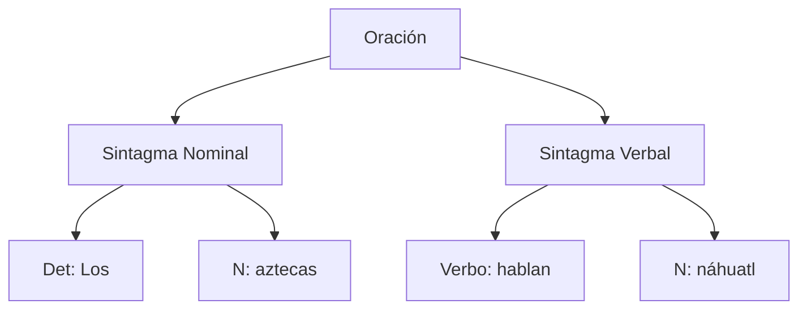
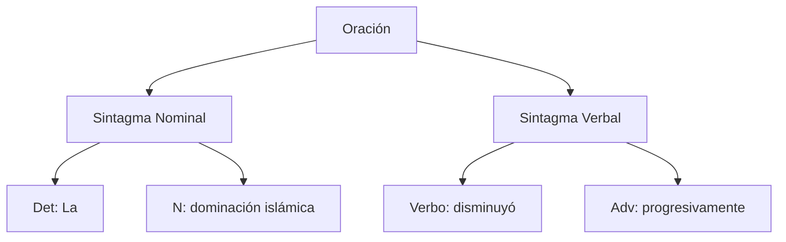
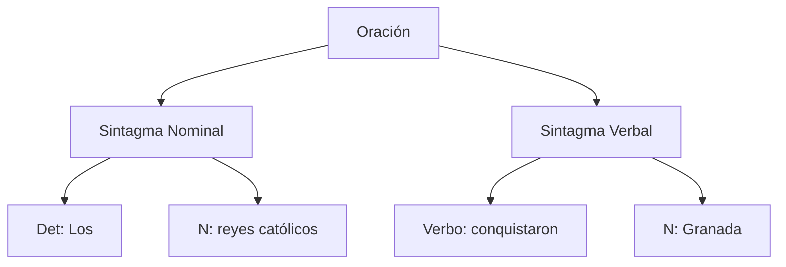
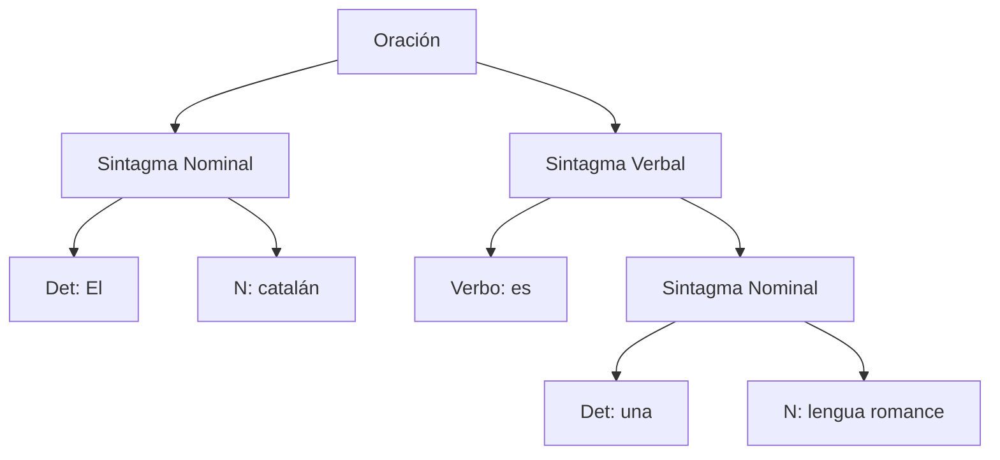
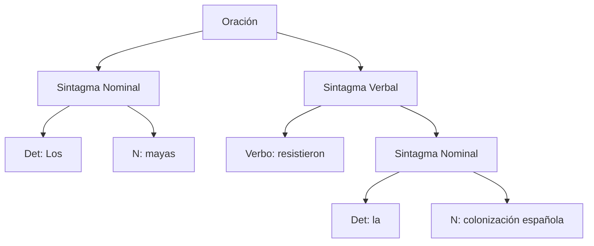
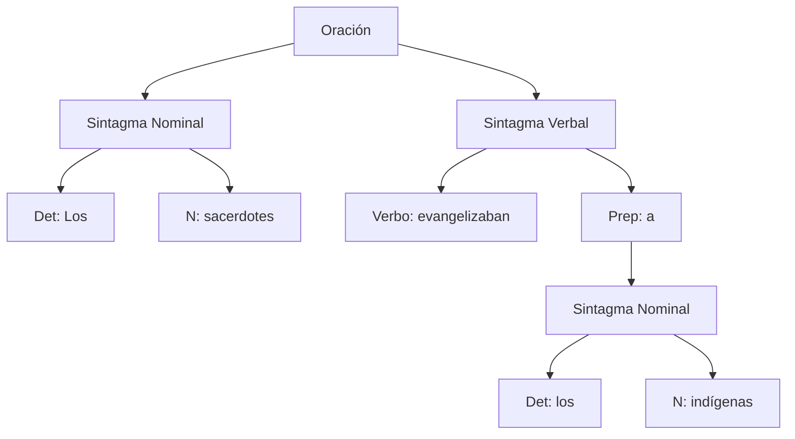
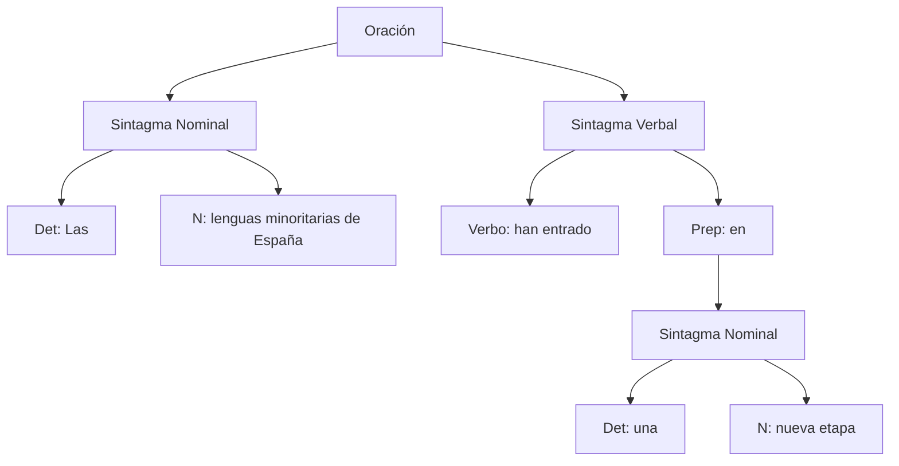
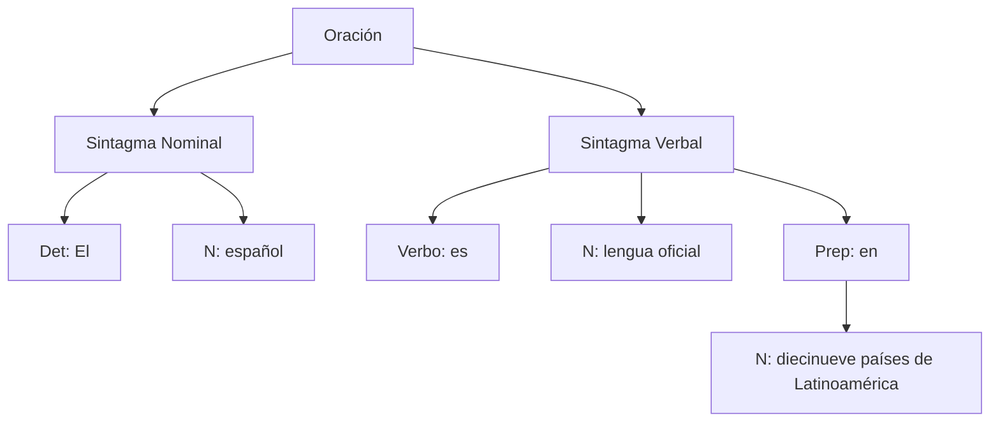
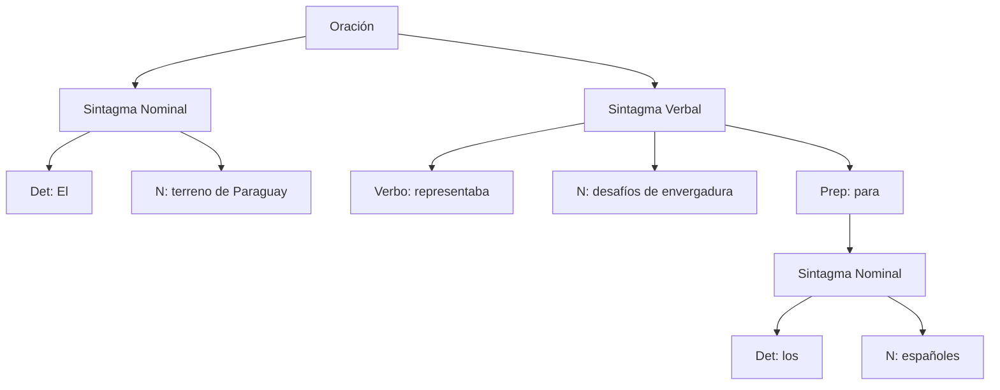
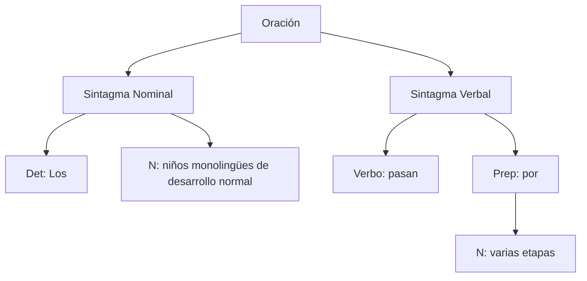

# Árboles sintácticos en Mermaid

Este repositorio contiene un trabajo práctico de gramáticas en Prolog y su representación visual mediante **árboles de derivación** usando **Mermaid**.  
El objetivo es mostrar cómo se analizan oraciones en español, dividiéndolas en **sintagma nominal (SN)** y **sintagma verbal (SV)**, y representarlas gráficamente para facilitar la comprensión.

---

## Oración 1: Los aztecas hablan náhuatl

## Oración 2: La dominación islámica disminuyó progresivamente

## Oración 3: Los reyes católicos conquistaron Granada

## Oración 4: El catalán es una lengua romance

## Oración 5: Los mayas resistieron la colonización española

## Oración 6: Los sacerdotes evangelizaban a los indígenas

## Oración 7: Las lenguas minoritarias de España han entrado en una nueva etapa

## Oración 8: El español es lengua oficial en diecinueve países de Latinoamérica

## Oración 9: El terreno de Paraguay representaba desafíos de envergadura para los españoles

## Oración 10: Los niños monolingües de desarrollo normal pasan por varias etapas

